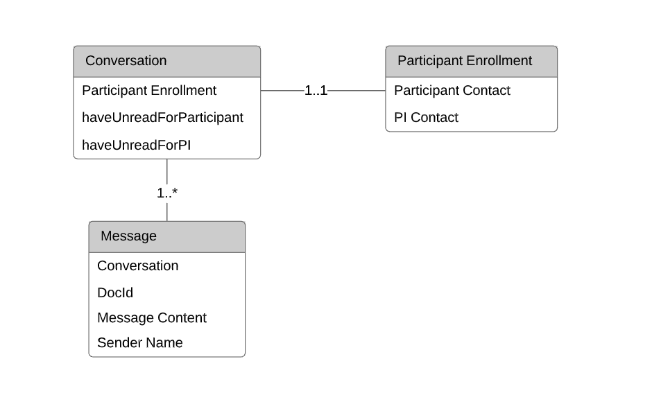

## User to User Communication

**Business logic**

This module is designed to provide communication between the study participant and his manager. 
Communication is via sending/receiving messages. 
Messages are grouped into conversations. 
When creating a new conversation, a “sharing record” is created for all its participants, which provides access to the conversation. 
Also, delegates from both sides participate in the conversation.

If the patient is involved in several active trials, each will display conversations that are specific to the study. 
The manager sees all the conversations to which he has access.
A patient message can only consist of a predefined list of questions. 
Messages manager contains free text (500-character limit) and optionally a file. 
The file is available for download to all participants in the conversation.
The manager can do a mass mailing for selected patients. 
For patients who have not previously created a conversation, it is created, and this message is added to existing conversations.
When you go to the “Messages” page, a conversation opens with the last received/sent message, if any.

**Page structure**

The page is divided into left and right parts. On the left are the “New Message” button and a list of conversations. On the right are the conversation header, messages, and Send panel. In the mobile version, only one active part is visible at a time.

**Components**

- messagesPage - The page container and main panel. It contains an array of conversationItem’s and messageBoard.
- conversationItem - The essence of the conversation.
- messageBoard - Right panel. It contains messageBoardHeader and a messageItem’s array.
- messageBoardHeader - The title of the message board. It is divided into two templates: desktop and mobile. The template is displayed depending on the screen format.
- messageItem - The essence of the message. It also includes an attachment.

####Data Model

------------------------------------------------------------------------------------------------------------------------

###Screen Shots

_Empty page_

_Participant conversation_

_PI mass message_

_Message with attachment_

